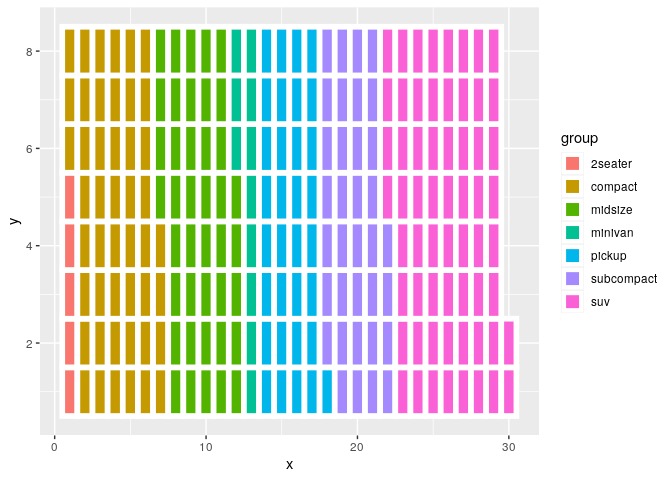
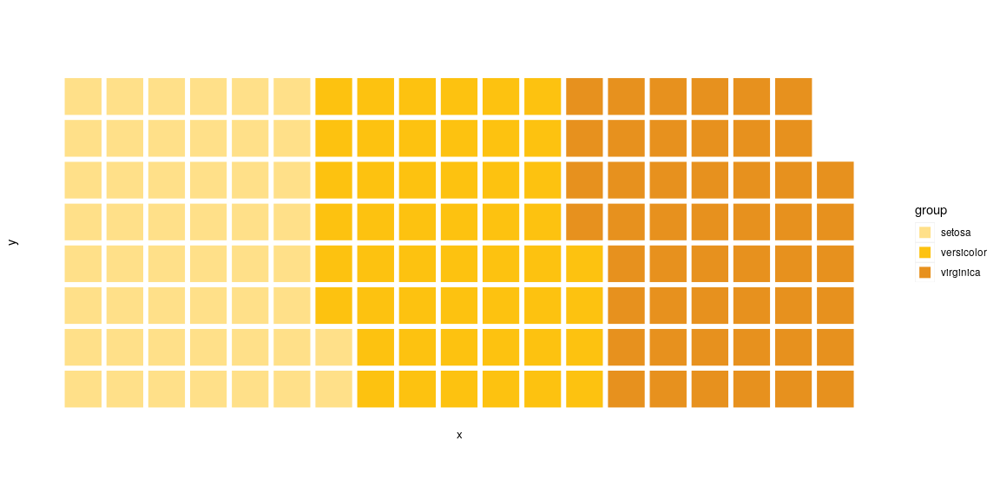
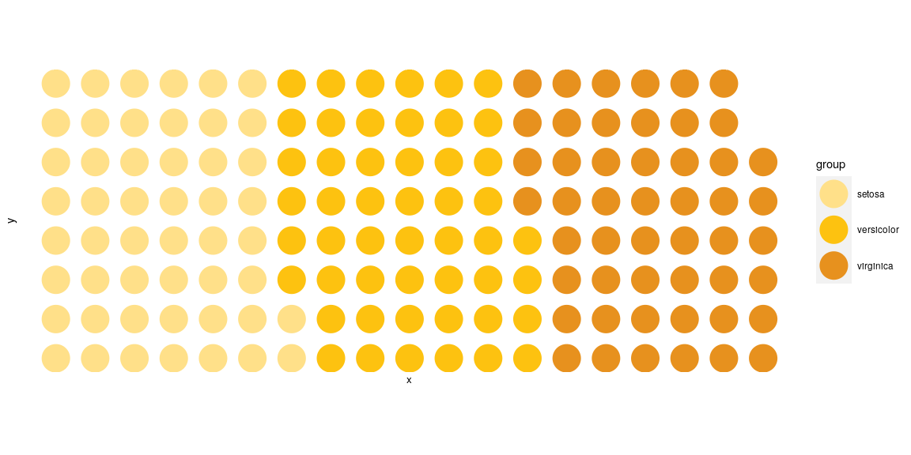
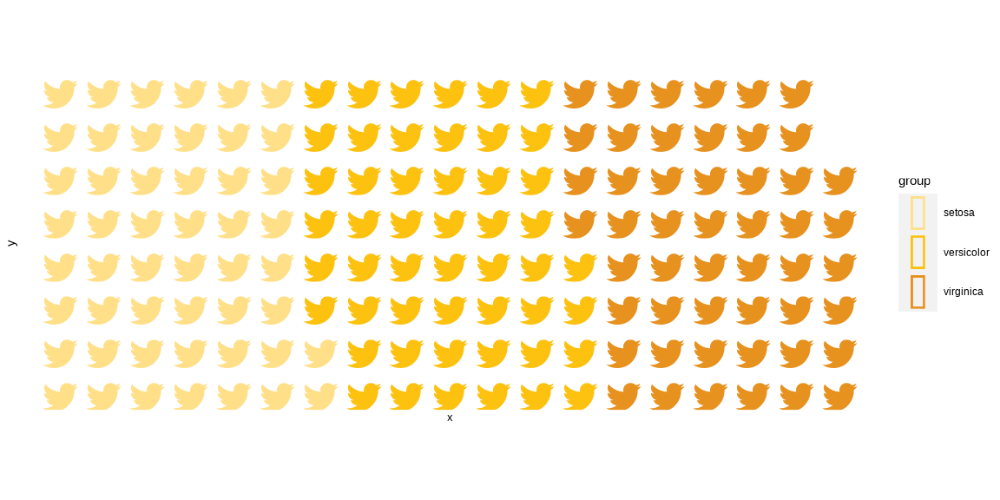

<!-- README.md is generated from README.Rmd. Please edit that file -->

# ggwaffle 

<!-- badges: start -->

[](https://travis-ci.org/liamgilbey/ggwaffle)
[](https://app.codecov.io/gh/liamgilbey/ggwaffle?branch=master)
<!-- badges: end -->

Create waffle charts in R in a ggplot2-friendly way.

## Acknowledgements

Really all credit to [Bob Rudis](https://github.com/hrbrmstr) for the
work done on the original [waffle
package](https://github.com/hrbrmstr/waffle).

## Description

ggwaffle is designed to work in a very similar way to the original
[waffle package](https://github.com/hrbrmstr/waffle), while being
slightly closer to the workflow of a standard ggplot graphic.
Consequently, it is a little more verbose.

## Installation

Currently only available through github:

``` r
# install.packages("devtools")
devtools::install_github("liamgilbey/ggwaffle")
```

## Usage

ggwaffle heavily relies on the usage of
[ggplot2](https://github.com/tidyverse/ggplot2). Much like standard
ggplot graphs, waffle charts are created by adding layers to a base
graphic. Because of the inner mechanisms of ggplot2, some of the
necessary data transformations have to be completed outside of a
standard plot creation. The function `waffle_iron` has been added to
help with issue.

ggwaffle also introduces a column mapping function, `aes_d`. At this
stage I have no idea of how useful this is outside the context of the
package, but it seemed a nice way to specify dynamic column renaming.
`aes_d` is obviously coined from ggplot’s `aes` function and has a very
similar idea. Here we are mapping column names to feed into a function
so they can be renamed for used appropriately.

``` r
library(ggwaffle)
#> Loading required package: ggplot2
waffle_data <- waffle_iron(mpg, aes_d(group = class))

ggplot(waffle_data, aes(x, y, fill = group)) + 
  geom_waffle()
```

<!-- -->

Functions have also been included to make the default graphics more
waffle-like. `theme_waffle` is a ggplot theme that strips back a lot of
the elements of the waffle to create a cleaner look. `scale_fill_waffle`
returns a discrete scale to make your charts look a lot like waffles.
Using `coord_equal` is recommended to make the size of the blocks even
in all dimensions.

``` r
waffle_data <- waffle_iron(iris, aes_d(group = Species))

ggplot(waffle_data, aes(x, y, fill = group)) + 
  geom_waffle() + 
  coord_equal() + 
  scale_fill_waffle() + 
  theme_waffle()
```

<!-- -->

The shape of the waffle tile can also be controlled, choosing from
either a regular square, or a circle tile shape.

``` r
waffle_data <- waffle_iron(iris, aes_d(group = Species))

ggplot(waffle_data, aes(x, y, colour = group)) + 
  geom_waffle(tile_shape = 'circle', size = 12) + 
  coord_equal() + 
  scale_colour_waffle() + 
  theme_waffle()
```

<!-- -->

# Icons

The best way to implement icons into waffle charts is to use Guangchuang
YU’s
[emojifont](https://cran.r-project.org/web/packages/emojifont/vignettes/emojifont.html)
package.

``` r
library(emojifont)  

waffle_data <- waffle_iron(iris, aes_d(group = Species)) 
waffle_data$label = fontawesome('fa-twitter')

ggplot(waffle_data, aes(x, y, colour = group)) + 
  geom_text(aes(label=label), family='fontawesome-webfont', size=12) +
  coord_equal() + 
  scale_colour_waffle() + 
  theme_waffle()  
```

<!-- -->
